# 🔗 Betweener App

**Betweener** is a human-centered mobile app that helps people connect more easily by putting all their social links in one place — and sharing them instantly, even with nearby users.

---

## ✨ Features

- Create a **custom profile** with all your important links.
- Use **Active Sharing** to discover and connect with nearby users.
- Share your profile via **QR Code**.
- **Add, edit, or delete links** at any time with a smooth UI.
- Secure login and Google sign-in supported.

---

## 📸 App Screens & Descriptions

### 📱 Onboarding Screen

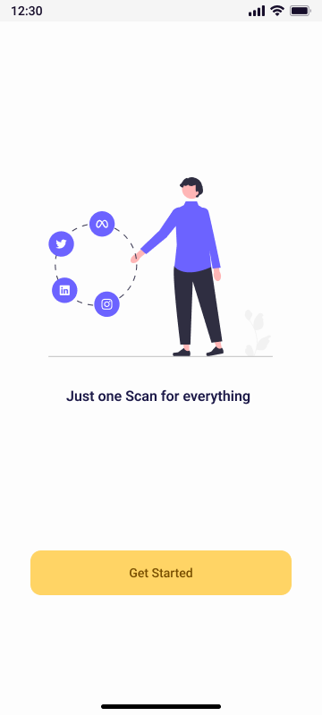

**Description:**  
> A simple and inviting welcome screen that introduces the app's purpose — scan once, share everything. It builds trust from the very first step.

---

### 📱 Register Screen

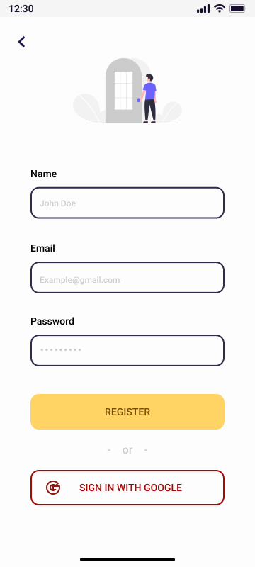

**Description:**  
> Allows the user to create a new account with name, email, and password, or register directly with Google for convenience.

---

### 📱 Login Screen

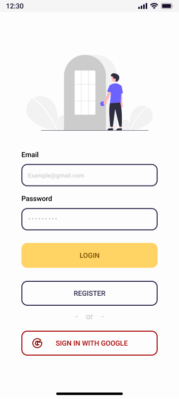

**Description:**  
> Secure login screen for returning users. Offers multiple ways to log in, including Google Sign-In.

---

### 📱 Home Screen

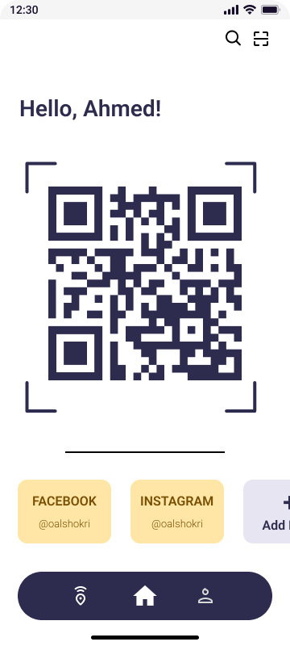

**Description:**  
> Displays your personal QR code and a list of your favorite social links. You’re one scan away from sharing your identity.

---

### 📱 Profile Screen

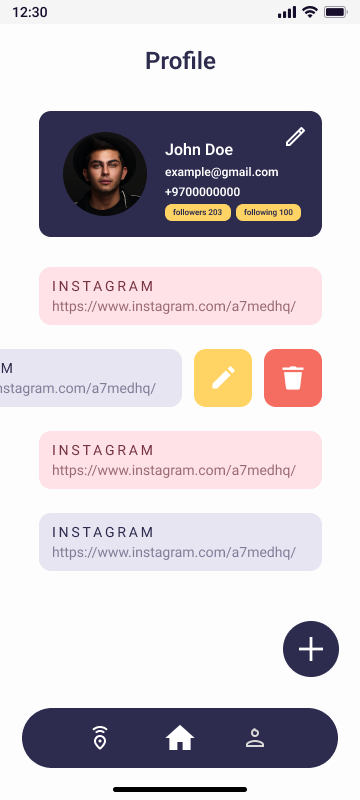

**Description:**  
> Shows your public profile with name, email, phone, followers/following, and your active links. You can edit or delete links easily.

---

### 📱 Edit Profile Screen

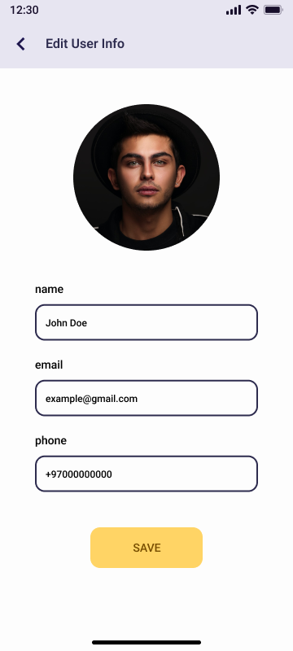

**Description:**  
> Lets you update your name, email, phone number, and profile image with a clean and intuitive layout.

---

### 📱 Add Link Screen

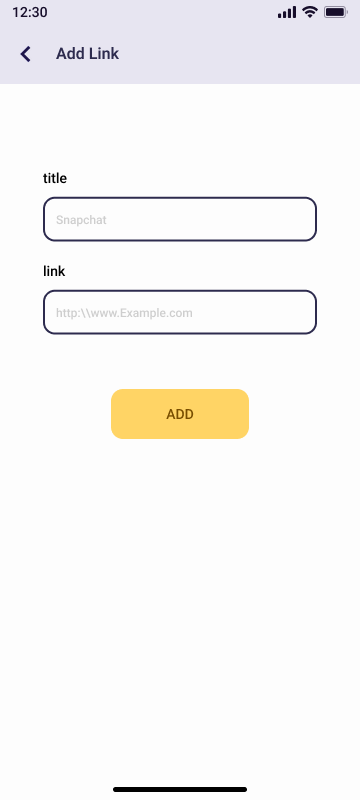

**Description:**  
> Add a new social or custom link to your profile. Perfect for expanding your digital identity.

---

### 📱 Edit Link Screen

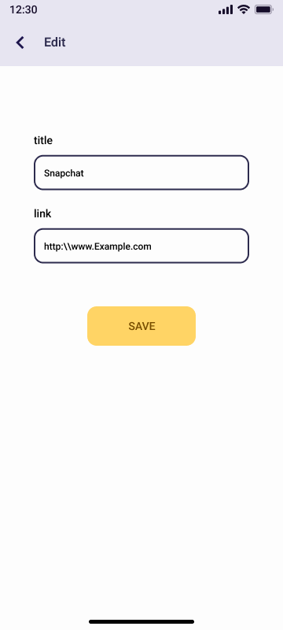

**Description:**  
> Modify an existing link — update its title or URL with ease.

---

### 📱 Friend Profile Screen

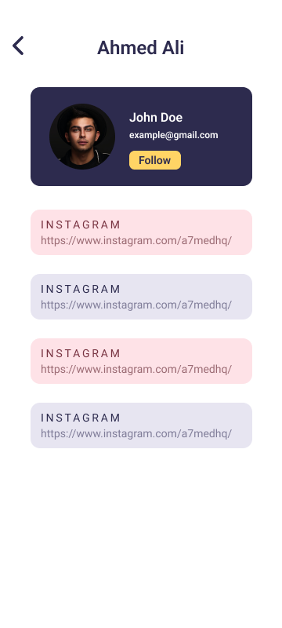

**Description:**  
> View another user's profile, including their shared links, and follow them to stay connected.

---

### 📱 Active Sharing Screen

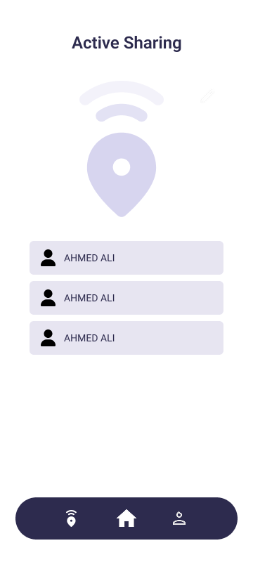

**Description:**  
> See nearby users who have activated sharing. Great for in-person events or networking meetups.

---

### 📱 QR Scanner Screen

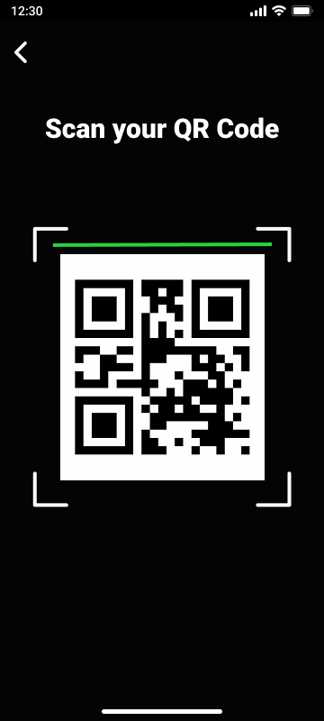

**Description:**  
> Scan a friend’s QR code and instantly view their profile and links.

---

## 🚀 Tech Stack

- Flutter + Dart  
- Firebase (Auth, Firestore)  
- Google Maps  
- QR Code (qr_flutter, scanner)  
- Provider / BLoC for state management  
- SQLite for local data caching

---

## 👨‍💻 About the Developer

This app was designed and developed with passion by Ahmad Herzalla, a Flutter enthusiast who loves building smart, people-focused applications.

---

## 📄 License

This project is licensed under the MIT License.

